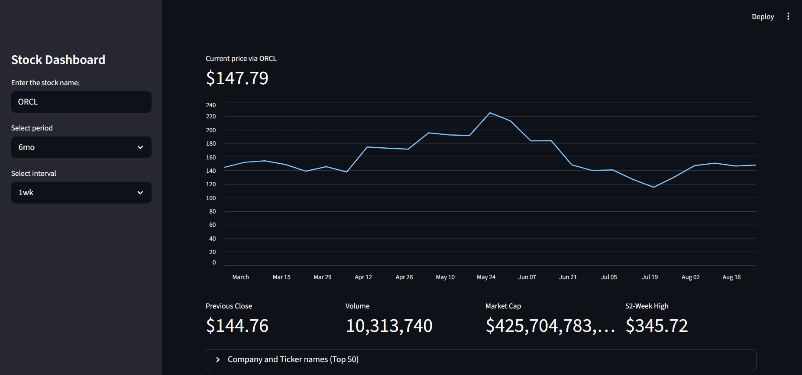
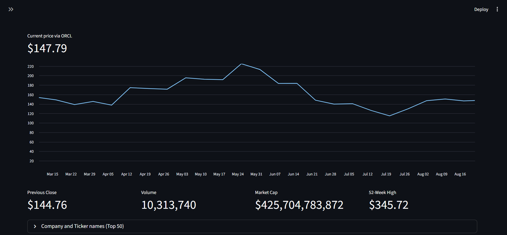
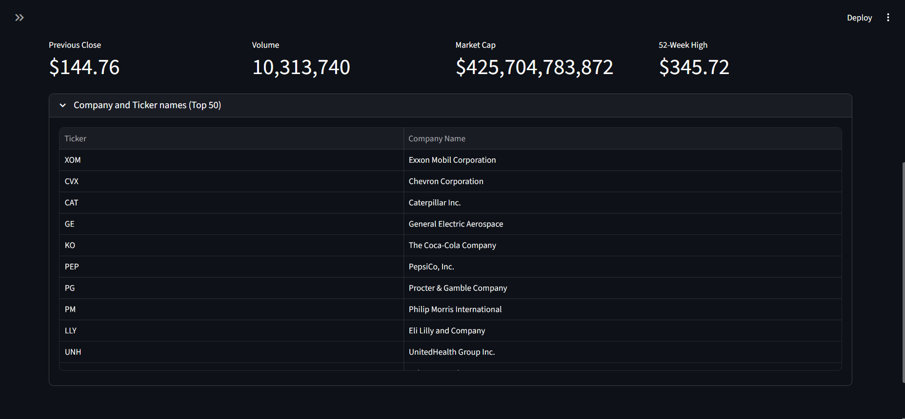

# Stock Price

A Python project for fetching, tracking, or analyzing stock price data.

## Overview
An interactive web dashboard built with Python and Streamlit that allows users to fetch, visualize, and analyze stock market data. By leveraging the yfinance API, the application provides a clean interface for tracking real-time prices, reviewing historical trends, and checking key financial metrics for any publicly traded company.

## Tech Stack
- Python
-  yfinance and pandas

## Features
- Dynamic Data Querying: Enter any stock ticker symbol via the sidebar to instantly fetch and display its current market price.
- Customizable Timeframes: Tailor your historical data view by selecting specific lookback periods (e.g., 6 months) and data intervals (e.g., 1 week).
- Key Financial Metrics at a Glance: Instantly view critical summary data including Previous Close, Trading Volume, Market Capitalization, and 52-Week High.
- Built-in Ticker Reference: Features a convenient, expandable lookup table listing the ticker symbols and full company names for 50 major corporations to help users quickly find the stocks they want to analyze.

## How to Run
```bash
pip install -r requirements.txt
streamlit run stock_price.py
```


[Stock price viewer](https://general-projects-rzkxb3anaaeekr7dufdggk.streamlit.app)

## Dashboard Previews

**Main Interface & Input Sidebar**


**Interactive Price Chart & Financial Metrics**


**Expandable Top 50 Company Tickers Reference**



## Project Structure
```
stock_price/
├── stock_price.py
└── README.md
```

## Author
Pranav K — [Pranav10261](https://github.com/Pranav10261)
