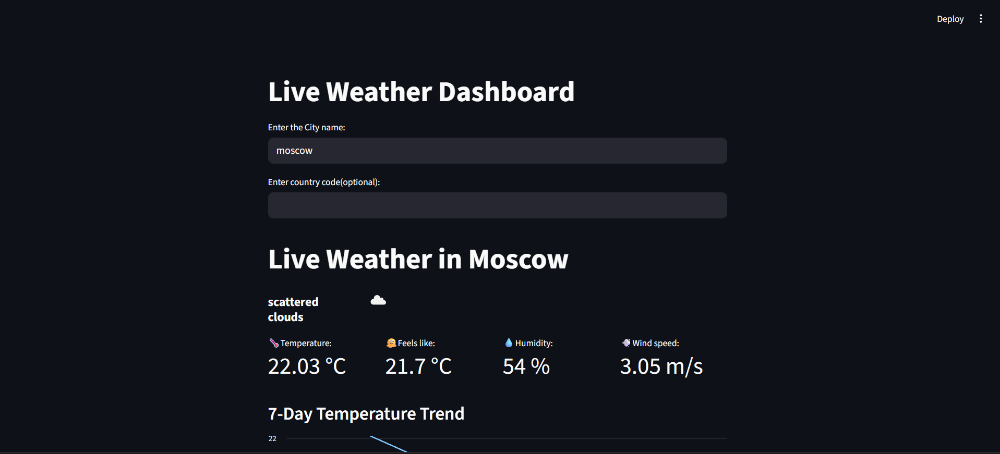
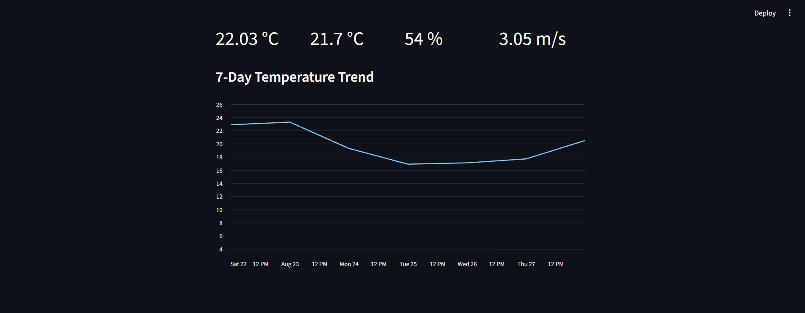

# Weather Dash: Global Real-Time & Historical Insights

A Python weather dashboard that displays live weather data in a simple visual interface.

[Live link](https://general-projects-4suzm5qnfyympgmhmqpsux.streamlit.app/)

## Overview
An interactive web application built with Python and Streamlit that provides real-time meteorological updates and historical context[cite: 3]. Designed to deliver daily business and travel insights, the dashboard offers professionals and travelers an instant, visually appealing snapshot of current conditions alongside week-long temperature trends for any global destination.

## Tech Stack
- Python
- Streamlit
- requests
- pandas
- **Environment Management:** os and Streamlit Secrets for secure API key configuration
- **APIs:** OpenWeatherMap (Real-time data)

## Features
- **Global Live Search:** Instantly fetch current weather data by entering any city name, with an optional country code input for higher precision.
- **Key Weather Metrics:** View essential atmospheric data at a glance, including exact Temperature, "Feels Like" temperature, Humidity percentage, and Wind Speed.
- **Visual Condition Indicators:** Utilizes intuitive emojis and dynamic text to describe current weather conditions (e.g., "overcast clouds ☁️") for quick user comprehension.
- **7-Day Historical Trends:** Leverages the Open-Meteo geocoding and forecast APIs to extract the past seven days of maximum temperatures, transforming the data into a Pandas DataFrame, and loading it into an interactive Streamlit line chart.
- **Robust Error Handling:** Safely parses API error responses as JSON instead of slicing strings, ensuring the application handles invalid city searches or dropped connections gracefully.

## How to Run
```bash
pip install -r requirements.txt
streamlit run weather_dash.py
```

## Screenshot
**Live Weather Interface & Metrics**



## Configuration
**You can configure it by adding it to your Streamlit secrets or setting it as an environment variable named 'API_KEY'**
```
.streamlit/secrets.toml/API_KEY = "your_openweathermap_api_key_here"
```

## Project Structure
```
Weather_dash/
├── Weather_dash.py
├── requirements.txt
└── README.md
```

## Author
Pranav K — [Pranav10261](https://github.com/Pranav10261)
