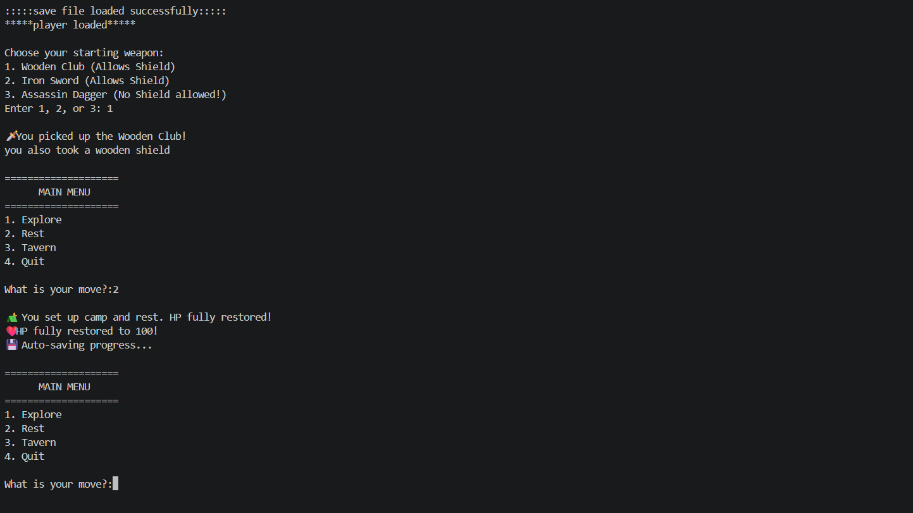

# Python OOP Combat Simulator
A Python-based, text-driven combat simulator demonstrating Object-Oriented Programming (OOP) and persistent state management.

## Overview
This project serves as a foundational interactive environment. It utilizes Python classes to handle complex logic gates for player stats, weapon scaling, and enemy encounters, while managing game state and progression via JSON data serialization.

## Tech Stack
- Python
- random, json, numpy

## Features
- **Object-Oriented Architecture:** Modular classes for Player, Weapon, and Encounter entities.
- **State Management:** Auto-saving and loading player progress and stats using JSON.
- **Dynamic Combat Logic:** Stat-driven combat mechanics utilizing `numpy` for enemy generation and scaling. 

## How to Run
```bash
pip install -r requirements.txt
python "game.py"
```

## Controls
The environment features an interactive command-line interface (CLI). Users drive the loop by entering numeric inputs (1-4) corresponding to tactical choices during exploration, combat, or resting phases.

## Screenshots


## Project Structure
```
game/
├── game.py
├──save_data.json
└── README.md
```

## Author
Pranav K — [Pranav10261](https://github.com/Pranav10261)
